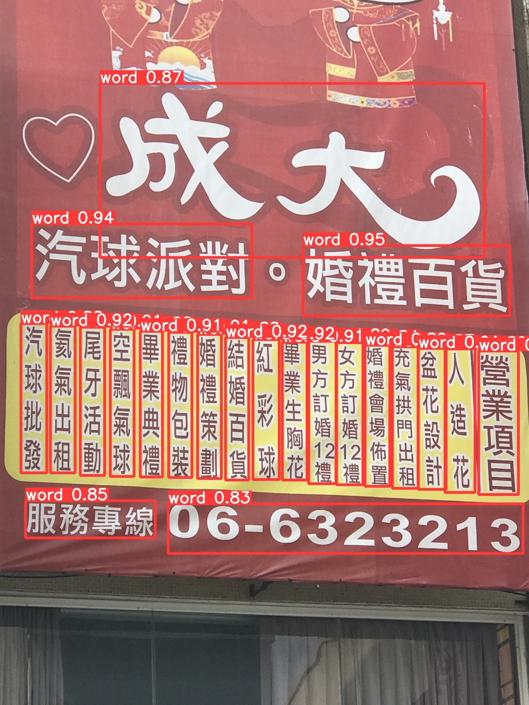
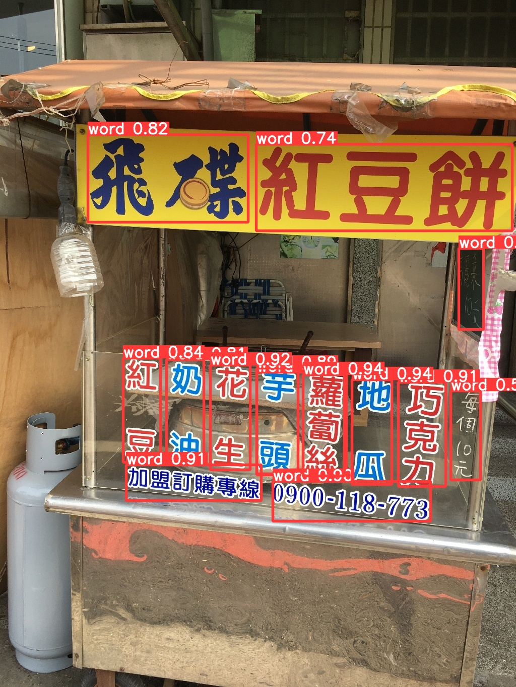
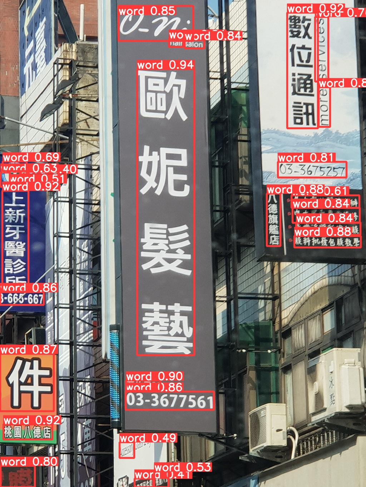

# Yolov5_FindCharacters
[Competitions網站](https://tbrain.trendmicro.com.tw/Competitions/Details/19)
## 1. 使用工具
Anaconda3 的 Python3.8 環境 
Google Colab (GPU)
## 2. Dataset
[Competitions](https://tbrain.trendmicro.com.tw/Competitions/Details/19) 中的 "Download Dataset" 提供訓練資料。
## 3. Preprocessing
參考資料「[繁體中文進階賽yolo介紹](https://www.youtube.com/watch?v=kKlKiKZo7UM&ab_channel=AICUP%E6%95%99%E8%82%B2%E9%83%A8%E5%85%A8%E5%9C%8B%E5%A4%A7%E5%B0%88%E6%A0%A1%E9%99%A2%E4%BA%BA%E5%B7%A5%E6%99%BA%E6%85%A7%E7%AB%B6%E8%B3%BD)」

下載並解壓縮大會提供的 train.zip 訓練資料。
* `draw_ground_truth.py` 將大會提供的座標 ( json 檔 )，實際畫出來。
* `yolov5_rectangle.py` 大會提供的 json 檔內座標畫出來為四邊形，而 yolov5 訓練模型的格式為矩形，所以先測試轉換的座標是否正確。
* `json_to_yolov5_txt.py` 確定上一步驟沒問題後，為了後續辨識方便，決定只讓模型學習抓出字串，不去學抓字元及###的內容，最後產生 yolov5 模型所需的 txt 檔。

下載[範例訓練資料](https://reurl.cc/AqpA98)。
* 將所有圖片與txt檔依照一定比例分成 ”train” & ”val” (此為8:2)，個別放到 images\train、images\val、labels\train、labels\val。
* `diff_img_txt.py` 確認產生的 txt 檔數量與訓練圖片數量是否相同，發現並不一致，找出哪些圖片沒有產出 txt 檔，並刪除那些圖片。
* `write_annotations_train.py` 在 annotations/train.txt 寫入所有訓練圖片檔案名稱。
* `write_annotations_val.py` 在 annotations/val.txt 寫入所有驗證圖片檔案名稱。

最後將 datasets 整個資料夾壓縮成 .zip，放到 google drive中。
## 4. Training Yolov5 Model & Validation
[Colab程式碼](https://colab.research.google.com/drive/1LciFOWUerJ1iFmhbWshft_8sNqZNlRCo?usp=sharing) (內附參考資料來源)。

# 結果展示

